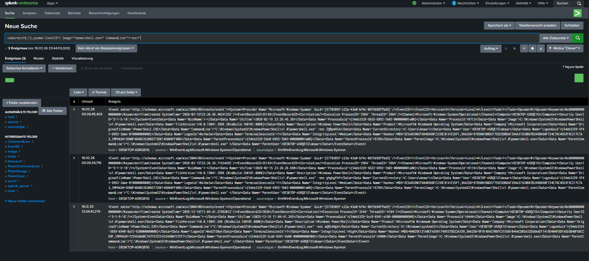

# INC-001 – Suspicious PowerShell Execution

## Date
2026-02-15

## Environment
- Operating System: Windows 10 (VMware)
- SIEM: Splunk Enterprise
- Log Source: Sysmon
- Event Type: Process Creation
- Event ID: 1

## Incident Description
A PowerShell process was detected executing with an encoded command.  
Encoded PowerShell commands are commonly used to obfuscate malicious activity and evade detection.

## Detection Logic (Splunk Query)

```spl
index=win10_13_sysmon EventID=1 Image="*powershell.exe*" CommandLine="*-enc*"
```

## Evidence
- Event ID: 1
- Image: powershell.exe
- CommandLine: powershell -enc ZQBpAHIA
- User: NT AUTHORITY\SYSTEM
- Parent Image: explorer.exe
- Host: DESKTOP-A5RQE1G

## Screenshots

### Splunk Detection Query


## Analysis
The use of encoded PowerShell commands is a common technique used by attackers to evade detection.
In this case, the activity was generated intentionally in a lab environment to validate detection logic.

## Severity
Medium

## Response Actions
- Event reviewed in Splunk
- Process execution verified
- No additional malicious activity detected
- System monitoring continued

## Conclusion
No system compromise was identified.
This incident confirms the effectiveness of Sysmon logging and Splunk-based detection for suspicious PowerShell activity.
