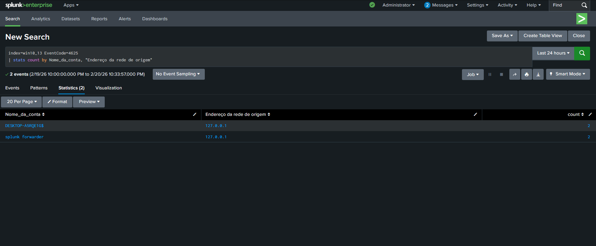

# INC-002 – Brute Force Login Attempts

## Date
2026-02-16

## Environment
- Operating System: Windows 10 (VMware)
- SIEM: Splunk Enterprise
- Log Source: Windows Security Logs
- Event ID: 4625

## Incident Description
Multiple failed login attempts were detected on a Windows system.
Repeated authentication failures may indicate a brute force attack attempt.

## Detection Logic (Splunk Query)

```spl
index=win10_13 EventCode=4625
| stats count by Nome_da_conta, "Endereço da rede de origem"
```
Evidence

Event ID: 4625

Failure Reason: Bad username or password

Logon Type: Interactive / Network

Target Account: Administrator

Source IP: 192.168.2.10

Host: DESKTOP-A5RQE1G

## Screenshots

### Splunk Detection Query


Analysis

Multiple failed authentication attempts against the same account may indicate a brute force attack.
No successful login (Event ID 4624) was detected following these attempts.

Severity

Medium

Response Actions

Failed login attempts reviewed

Account monitored for further activity

Password policy verification recommended

Conclusion

No account compromise was confirmed.
The incident demonstrates effective monitoring of authentication failures using Windows Security logs and Splunk.
