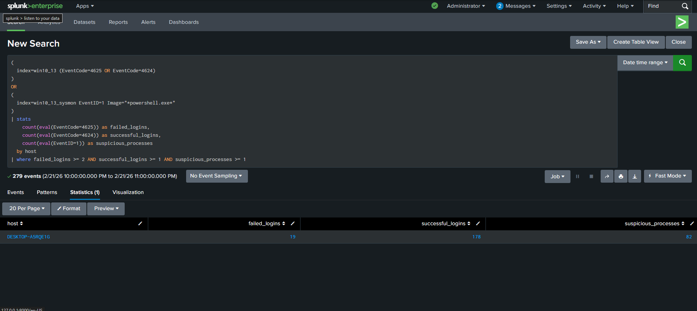

# INC-004 – Brute Force Followed by Suspicious Activity

## Date
2026-02-21

## Environment
- Operating System: Windows 10 (VMware)
- SIEM: Splunk Enterprise
- Log Sources:
  - Windows Security Logs
  - Sysmon

## Incident Description
Multiple failed login attempts were detected on a Windows host, followed by a successful login.
Shortly after the successful authentication, suspicious PowerShell activity was observed on the same system.
This sequence may indicate a successful brute force attack followed by post-exploitation activity.

## Correlation Logic
The detection correlates the following events:
- Event ID 4625: Failed login attempts
- Event ID 4624: Successful login
- Sysmon Event ID 1: Suspicious PowerShell process execution

## Detection Logic (Splunk Query)

```spl
(
  index=win10_13 (EventCode=4625 OR EventCode=4624)
)
OR
(
  index=win10_13_sysmon EventID=1 Image="*powershell.exe*"
)
| stats 
    count(eval(EventCode=4625)) as failed_logins,
    count(eval(EventCode=4624)) as successful_logins,
    count(eval(EventID=1)) as suspicious_processes
  by host
| where failed_logins >= 3 AND successful_logins >= 1 AND suspicious_processes >= 1
```
Evidence

Failed login attempts detected (Event ID 4625)

Successful login detected (Event ID 4624)

PowerShell execution detected after login (Sysmon Event ID 1)

Host: DESKTOP-A5RQE1G

## Screenshots

### Alert Configuration


### Alert Results


Analysis

The combination of repeated failed login attempts followed by a successful login suggests a potential brute force attack.
The subsequent execution of PowerShell increases the risk level, as scripting engines are often used for post-exploitation activities.
This correlation reduces false positives by requiring multiple related events before triggering an alert.

Severity

High

Response Actions

Correlated alert reviewed in Splunk

Account activity monitored

No further malicious actions observed

Continued monitoring recommended

Conclusion

No confirmed compromise was identified in this lab scenario.
This incident demonstrates effective use of event correlation to detect complex attack patterns and reduce false positives in a SOC environment.
